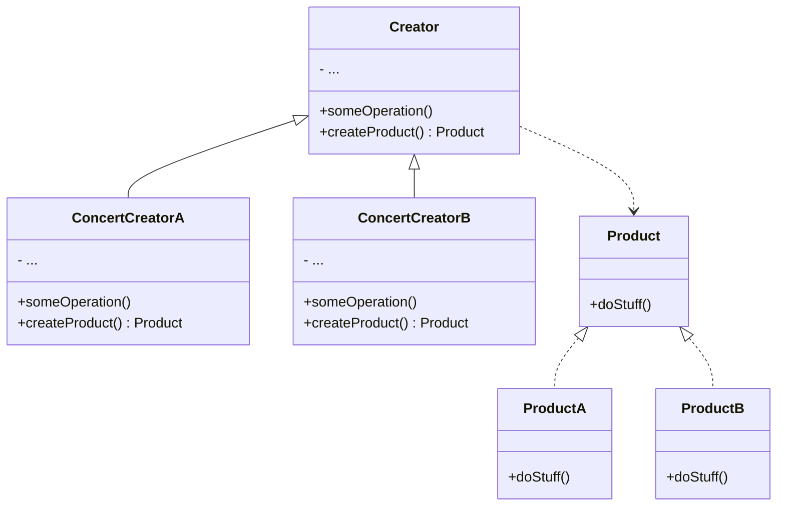

# Factory Model

## Concept
Factory is a simple creational design pattern. We often use factory to create different type of products.

## Example
Image that you a engineer of a computer factroy. You often deliver computer by trunk. One day, you find air transport is more cheap. 
So you decide to expand your system to support air feight. How can you do now? 

Maybe your initial softerware just have a trunkLogostocs class to represent the trunk transportation. You immediately think of an idea. You decide to create a class called airportLogostocs which mimics trunkLogostocs class. But you find it is annoying to embed the two seperate class in your system. Why?

You will find all you code is bound to the specific class. It is not easy to expand it.

So you need a new method to separate transport logic from the specific calss.

## UML

